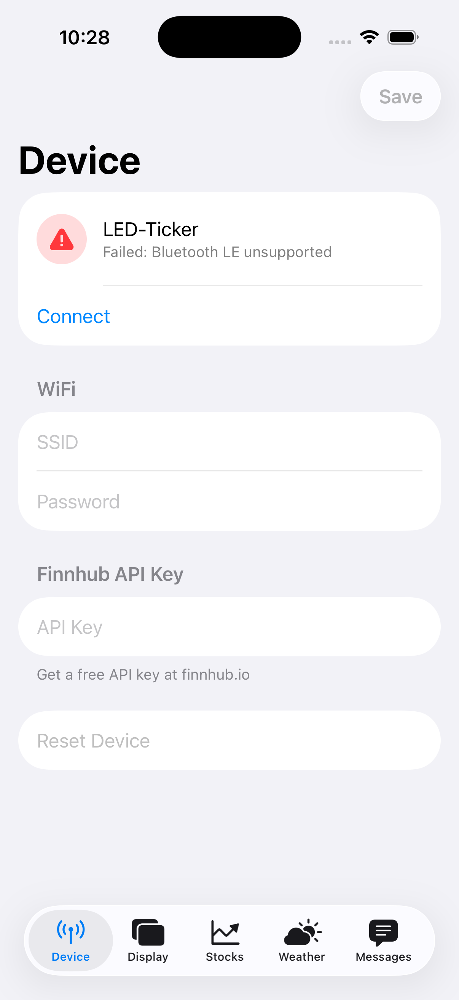

# LED Ticker iOS App

SwiftUI + CoreBluetooth app that mirrors `tools/led.py` — configure the
ESP32 LED Ticker over BLE from your iPhone or iPad.

<p align="center">
  
</p>

## Requirements

- Xcode 15 or newer
- iOS 16+ device (the iOS simulator has no Bluetooth radio)
- [XcodeGen](https://github.com/yonaskolb/XcodeGen): `brew install xcodegen`

## Build

```bash
cd ios
xcodegen generate
open LEDTicker.xcodeproj
```

Then in Xcode:

1. Select the **LEDTicker** scheme.
2. Pick your physical iPhone/iPad as the run destination.
3. Build & run (⌘R). iOS will prompt for Bluetooth permission on first
   launch.

## Signing

The Xcode project is generated from `project.yml` and the pbxproj is
gitignored, so **do not edit signing in Xcode's Signing & Capabilities
pane** — UI edits get wiped the next time `xcodegen generate` runs.

Signing is driven by two xcconfig files in this directory:

| File                    | Checked in? | Purpose                                    |
|-------------------------|-------------|--------------------------------------------|
| `Signing.xcconfig`      | Yes         | Safe defaults (style, identity). No team.  |
| `Signing.local.xcconfig`| **No**      | Your personal `DEVELOPMENT_TEAM` override. |

Simulator builds work out of the box with no local override.

For **device builds**, create `ios/Signing.local.xcconfig` with a single
line:

```
DEVELOPMENT_TEAM = YOURTEAMID
```

You can find your Team ID at
<https://developer.apple.com/account> → Membership. Then run
`xcodegen generate` and build to your device as usual. The `.local`
file is gitignored so your team ID never lands in the public repo.

## Run tests

```bash
cd ios
xcodegen generate
xcodebuild test \
    -project LEDTicker.xcodeproj \
    -scheme LEDTicker \
    -destination 'platform=iOS Simulator,name=iPhone 17 Pro'
```

The test target exercises `Payloads.swift` (pure formatting logic) and
`KnownDevice.swift` (persistence and legacy-key migration). `BLEManager`
needs a real device and is not unit-tested.

## Layout

```
ios/
├── project.yml            XcodeGen config — regenerate the .xcodeproj from here
├── LEDTicker/
│   ├── LEDTickerApp.swift The @main entry point
│   ├── RootView.swift     5-tab TabView (no auto-connect on launch); gates non-Device tabs behind connection state
│   ├── DisconnectedView.swift  Empty-state panel shown on non-Device tabs while disconnected
│   ├── AppState.swift     Shared observable state
│   ├── BLEManager.swift   CoreBluetooth wrapper: known-devices list, active connection, queued I/O
│   ├── KnownDevice.swift  Persisted device entry (id, friendlyName, advertisedName, lastConnected)
│   ├── Payloads.swift     Pure payload formatters (mirrors tools/led.py)
│   ├── DeviceTab.swift    Known Devices + WiFi + API key + Reset
│   ├── DisplayTab.swift   Mode status + multi-category toggles
│   ├── StocksTab.swift    Tickers
│   ├── WeatherTab.swift   Locations
│   ├── StatusTab.swift    Active sign + iOS-local preset chips
│   ├── Toast.swift        Toast overlay
│   └── Info.plist         Contains NSBluetoothAlwaysUsageDescription
└── LEDTickerTests/
    ├── PayloadsTests.swift
    └── KnownDeviceTests.swift
```

## Design notes

- **Five-tab layout**: Device (connection, WiFi, API key, reset),
  Display (current mode status + multi-category toggles, with prereq
  gating and an at-least-one invariant), Stocks (tickers), Weather
  (locations), Sign (active status text + preset chips). Mode changes
  are made exclusively from the Display tab; the content tabs are
  read/write for their own data only.
- **Active sign**: the device tracks a single "status" (text + optional
  expiry) that preempts the ambient scroll. Setting it from the Sign
  tab writes the Status characteristic; clearing it resumes the
  ambient mode. The preset chips on that tab are **iOS-local** —
  stored in `UserDefaults` under `presetTexts.v1`, never synced to the
  device or across clients. Edit them from the toolbar on the Sign tab.
- **WiFi SSID and Finnhub API key** are persisted to `UserDefaults` so
  the user doesn't have to retype them on every launch. Everything
  else (tickers, locations, active sign, display mode) is fetched
  fresh from the device on each connect. The WiFi password is never
  persisted and never exposed over BLE; the user retypes it on each
  launch.
- **Disconnected UX**: only the Device tab is usable while
  disconnected. The Display / Stocks / Weather / Sign tabs render a
  shared empty-state panel (`DisconnectedView`) that adapts its copy
  to the current BLE state (Bluetooth off, permission denied,
  connecting, failed, idle) and offers a single "Open Device tab"
  button that switches the selected tab. Tabs aren't disabled —
  Apple's HIG treats the tab bar as navigation and disabling nav
  items tends to confuse — but their content is gated.
- **Writes and reads are both queued**: every operation uses
  `.withResponse` / `readValue(for:)` and the next is only issued after
  the corresponding delegate fires. This matters because the firmware
  has a 10 s cooldown on ticker/reload/reset writes.
- **Multi-device switcher**: the app remembers a list of LED-Tickers
  under `LEDTicker.knownDevices` in `UserDefaults` (JSON-encoded
  `[KnownDevice]`, MRU-sorted). The Device tab's "Known Devices"
  section shows each remembered device with an in-range / connecting /
  connected / not-in-range badge, plus any nearby-but-not-enrolled peripherals as
  rows with a "Tap to add" affordance. Swipe a row to Rename (alert) or Forget
  (confirmation dialog). One BLE connection is active at a time —
  tapping a different device disconnects the current one first.
- **No auto-connect on launch**: the app shows the Known Devices list
  on launch and waits for the user to tap a row. Nothing connects
  until that explicit tap, so opening the app never silently
  re-attaches to whichever device happens to be in range.
  (Existing single-device users are still migrated silently from the
  old `LEDTicker.peripheral.id` key into a one-element Known Devices
  list with a placeholder name that the next discovery will refine.)
- **No WiFi auto-fill**: iOS does not expose the phone's SSID or
  password to apps without the Access WiFi Information entitlement
  (paid developer account + extra permissions), and never the password.
  The user must type both in.

## Protocol reference

See `../README.md` and `../CLAUDE.md` for the authoritative description
of the BLE service and its characteristics. Payload formats:

| Char      | UUID suffix | Payload                                       |
|-----------|-------------|-----------------------------------------------|
| tickers   | `...A8`     | `AAPL,MSFT,...` (comma-separated)             |
| mode      | `...A9`     | `all` \| `<cat>` \| `<cat>,<cat>,...` (cat: stocks \| weather \| clock); read may also return `setup` |
| _(26AA)_  | `...AA`     | _Reserved tombstone — was "messages" in older firmware, no longer registered._ |
| command   | `...AB`     | `reload` or `reset`                           |
| wifi      | `...AC`     | `SSID\|password` (split on first `\|`)        |
| apikey    | `...AD`     | plain string                                  |
| locations | `...AE`     | `ZIP\|City, State\|...` (≤ 5 entries, 204 B)  |
| status    | `...AF`     | write: `text\|N` (`N` = seconds, `0` = indefinite, empty = clear); read: `text\|M` (`M` = seconds remaining, `0` = indefinite) or empty when no sign active |
